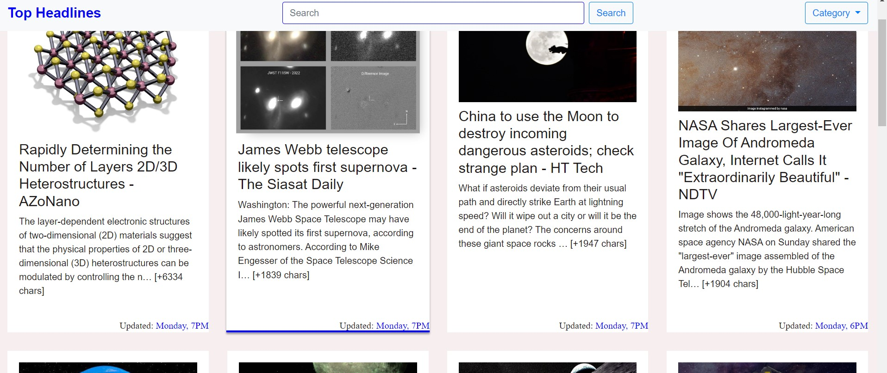

# News-website

  News Website made using Nodejs which fetches news articles from the web using the newsapi

  

  

<h2>Requirements:</h2>
HTML 
CSS 
Node JS  
EJS  
<a href = "https://newsapi.org/">News api key </a>

  
  

<h2> Installation</h2>

To run this project, install it locally using npm:

<pre><code>$ npm start
$ npm install
$ node app.js
</code></pre>

# Images

